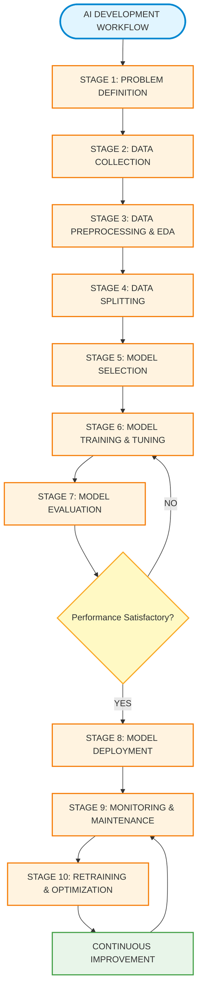

# AI Development Workflow Assignment

**Course:** AI for Software Engineering  
**Duration:** 7 days  
**Total Points:** 100  
**Group Members:** [Your Group Members Names Here]  
**Date:** [Submission Date]

---

## Table of Contents

1. [Part 1: Short Answer Questions](#part-1-short-answer-questions)
2. [Part 2: Case Study Application](#part-2-case-study-application)
3. [Part 3: Critical Thinking](#part-3-critical-thinking)
4. [Part 4: Reflection & Workflow Diagram](#part-4-reflection--workflow-diagram)
5. [References](#references)

---

## Part 1: Short Answer Questions (30 points)

### 1. Problem Definition (6 points)

#### a. Define a hypothetical AI problem

**Problem Statement:**  
Predicting daily supermarket/store sales demand for fresh bread.

**Context:**  
Supermarkets face a constant challenge of determining how much bread to bake daily. Over-baking leads to waste and financial loss, while under-baking results in stockouts, disappointed customers, and lost revenue. This AI system aims to forecast daily bread demand using historical sales, weather patterns, and other relevant factors.

---

#### b. List 3 objectives and 2 stakeholders

**Objectives:**

1. **Minimize Food Waste**  
   Accurately predict demand to prevent over-baking and reduce unsold bread. Even a 10% reduction in waste can save thousands of dollars annually and reduce environmental impact.

2. **Optimize Production**  
   Improve operational efficiency by creating accurate schedules for staffing and raw ingredient orders. This allows better planning for flour, yeast procurement, and baker shift scheduling.

3. **Prevent Stockouts**  
   Ensure sufficient stock during peak times to protect revenue and customer satisfaction. Repeated stockouts damage customer loyalty and may drive customers to competitors.

**Stakeholders:**

1. **Store Manager**  
   Oversees overall store profitability. Needs the system to minimize waste costs and prevent revenue loss from stockouts. Uses predictions for strategic decisions on inventory, pricing, and promotions.

2. **Bakery Department Head**  
   Manages daily bakery operations. Requires daily predictions to plan production schedules, manage ingredient inventory, and schedule staff appropriately.

---

#### c. Propose 1 Key Performance Indicator (KPI) to measure success

**KPI:** Percentage reduction in daily bread waste.

**Rationale:**  
This metric is easily measurable by counting unsold loaves before and after AI implementation. It directly ties to business value, as each wasted loaf represents lost money and environmental impact. A clear target, such as 40% waste reduction within 3 months, provides a concrete success measure that stakeholders can understand and track.

---

### 2. Data Collection & Preprocessing (8 points)

#### a. Identify 2 data sources for your problem

**Data Source 1: Historical Sales Data (Point-of-Sale System)**

Contains transaction timestamps, quantities sold, bread types, prices, and stockout times. This data reveals actual customer demand patterns, seasonal trends, peak shopping hours, and provides 12-24 months of historical foundation for pattern recognition.

**Data Source 2: External Data (Weather & Calendar Information)**

Includes weather forecasts (temperature, precipitation), public holidays, school breaks, and local events. Weather affects shopping behavior, holidays change purchasing patterns, and local events impact foot traffic. Sources include weather APIs like OpenWeatherMap and public holiday databases.

---

#### b. Explain 1 potential bias in the data

**Stockout Bias (Censored Demand)**

Sales data shows low demand on days when bread sold out early, not because customers didn't want more, but because none was available. This "censored demand" means we only see sales until stock depleted, not true customer demand. For example, if 100 loaves sold out by 2 PM, actual demand might have been 150, but only 100 was recorded.

**Impact:** The model learns from recorded sales rather than actual demand, leading to systematic under-prediction on high-demand days. This perpetuates stockouts and defeats our objective of preventing them.

---

#### c. Outline 3 preprocessing steps

**1. Handling Missing Data**

Fill gaps in data caused by system downtime or unavailable information. For small gaps (1-2 hours), use averages of surrounding values. For complete missing days, use the average of the same weekday from surrounding weeks. For missing weather data, use historical averages or alternative APIs.

**2. Feature Engineering**

Create meaningful features from raw data. Transform dates into DayOfWeek (1-7), IsWeekend (0/1), Month (1-12), and IsHoliday (0/1). Convert weather into IsRainy, TemperatureCategory, and IsSevereWeather. Create sales-based features like SalesLast7Days, SalesSameDayLastWeek, and TrendDirection. This gives the model actionable patterns to learn from.

**3. Normalization (Feature Scaling)**

Rescale numerical features to a common range (0-1) so features with different units are treated fairly. Without normalization, features with larger numbers dominate learning, even if less important. Apply Min-Max scaling: divide the difference between each value and the minimum by the range (maximum minus minimum).

---

### 3. Model Development (8 points)

#### a. Choose a model and justify your choice

**Model:** Random Forest Regressor

**Justification:**  
Random Forest is an ensemble method that creates multiple decision trees and averages their predictions. It's ideal for this problem because it handles mixed data types (categorical like holidays, numerical like temperature) without complex transformations, captures non-linear relationships (sales don't change linearly with weather), and resists overfitting through its averaging approach. It also provides feature importance rankings and handles outliers well, making it robust and interpretable for stakeholders.

---

#### b. Describe how you would split data into training/validation/test sets

**Three-Way Time-Based Split:**

- **Training Set (70%)** - Older historical data (e.g., Jan 2022 - Dec 2023) for the model to learn patterns
- **Validation Set (15%)** - Recent data (e.g., Jan 2024 - Mar 2024) for tuning hyperparameters  
- **Test Set (15%)** - Most recent data (e.g., Apr 2024 - Jun 2024) for final evaluation

**Rationale:**  
Time-based splitting (not random shuffling) is crucial because it mimics real deployment where the model trained on past data predicts future sales. This chronological split ensures honest performance estimation.

---

#### c. Name 2 hyperparameters you would tune and why

**1. n_estimators (Number of Trees)**

Controls how many decision trees the Random Forest creates. Too few trees (e.g., 10) leads to high variance and less accurate predictions. Optimal range (100-200) balances accuracy and training speed. Too many trees (1000+) provides minimal accuracy improvement while significantly increasing training time.

**2. max_depth (Maximum Tree Depth)**

Controls how many questions each tree can ask before making a prediction. Shallow trees (depth 2-3) underfit and miss important patterns. Optimal depth (8-12) captures meaningful patterns without memorizing noise. Deep trees (20+) overfit by memorizing training data specifics, performing poorly on new data.

---

### 4. Evaluation & Deployment (8 points)

#### a. Select 2 evaluation metrics and explain their relevance

**1. Mean Absolute Error (MAE)**

Measures average prediction error in loaves of bread. It's easily understood by stakeholders - "on average, forecasts will be wrong by 6 loaves." This directly translates to business costs: if each loaf costs $2 and MAE is 6 loaves, the daily forecast error cost is $12. It's actionable for planning and treats over-predictions and under-predictions equally.

**2. R-squared (R²)**

Measures how much sales variation the model explains, scored between 0 and 1. A high R² (0.7-0.9) means features like weather and holidays genuinely predict sales. Low R² (0.2-0.4) indicates sales are mostly random or missing key features. It validates feature selection and communicates confidence to stakeholders about the model's predictive power.

---

#### b. What is concept drift? How would you monitor it post-deployment?

**Concept Drift:**  
Occurs when real-world patterns the model learned change over time, reducing prediction accuracy. Examples include new competitors opening nearby, consumer behavior shifts (low-carb diet trends), store changes (renovations), or neighborhood changes (new residential development).

**Monitoring Strategy:**

Implement daily automated logging of predictions versus actual sales, calculating error metrics. Track 7-day and 30-day rolling average errors. Set threshold-based alerts: Warning when error exceeds 1.5× baseline, Critical when it exceeds 2× baseline. Monitor for directional bias (consistent over-prediction or under-prediction). When critical alerts persist for 3+ days, trigger automated retraining with recent data. Maintain a visual dashboard showing performance trends and alert history.

---

#### c. Describe 1 technical challenge during deployment

**Challenge: Data Pipeline Reliability and Dependencies**

The prediction system must automatically pull data from multiple sources nightly. Failures at any point break the entire pipeline. The weather API might timeout or hit rate limits, the POS database might be under maintenance, network connectivity could fail, or data formats might change unexpectedly after system upgrades.

**Solutions:**  
Implement robust error handling with retry logic and exponential backoff. Use fallback data sources (multiple weather APIs, cached historical data). Run health checks before main processes. Validate data quality before use. Implement graceful degradation (make predictions with available data, noting reduced confidence). Log all processes comprehensively and send alerts on failures. Schedule redundant runs (10:30 PM health check, 11:00 PM main run, 11:30 PM backup, 6:00 AM final check).

---

## Part 2: Case Study Application (40 points)

### Scenario
A hospital wants an AI system to predict patient readmission risk within 30 days of discharge.

> **[TO BE FILLED]**
> 
> *This section will cover:*
> - *Problem Scope (5 points)*
> - *Data Strategy (10 points)*
> - *Model Development (10 points)*
> - *Deployment (10 points)*
> - *Optimization (5 points)*

---

## Part 3: Critical Thinking (20 points)

> **[TO BE FILLED]**
> 
> *This section will cover:*
> - *Ethics & Bias (10 points)*
> - *Trade-offs (10 points)*

---

## Part 4: Reflection & Workflow Diagram (10 points)

### Reflection (5 points)

#### What was the most challenging part of the workflow? Why?

The most challenging part of the AI development workflow was **data preprocessing and feature engineering**. This stage required careful consideration of multiple factors:

**Challenges Encountered:**

1. **Identifying and Handling Data Biases** - Recognizing stockout bias in the bread sales data was particularly challenging. We had to think critically about what the data truly represented versus what we needed it to represent. Missing sales due to stock unavailability don't indicate lack of demand, yet they appear as low sales in the data.

2. **Feature Engineering Decisions** - Determining which features would be most predictive required domain knowledge and experimentation. For instance, deciding whether to include day of week, weather conditions, holidays, or promotional events, and how to encode these features properly (categorical vs. numerical) was complex.

3. **Balancing Data Quality and Quantity** - We faced the dilemma of whether to discard incomplete records or impute missing values. Each approach has trade-offs that could impact model performance.

**Why This Was Challenging:**

- It required both technical skills (coding, statistical knowledge) and domain understanding (business context)
- Poor decisions at this stage compound through the entire pipeline, affecting model performance
- There's often no single "correct" answer, requiring judgment calls and iterative refinement
- The impact of preprocessing decisions isn't always immediately visible until model evaluation

---

#### How would you improve your approach with more time/resources?

With additional time and resources, I would implement the following improvements:

**1. Enhanced Data Collection**

- **Collect Additional Features:** Customer foot traffic data from sensors, competitor pricing and promotions, social media sentiment, local event information, and historical bread variety preferences
- **Extend Historical Data Range:** Gather 2-3 years of data to capture seasonal patterns, yearly trends, and anomalies

**2. Advanced Preprocessing Techniques**

- **Automated Feature Selection:** Implement feature importance analysis using SHAP values or permutation importance, validated by domain experts
- **Advanced Imputation Methods:** Use K-Nearest Neighbors (KNN) imputation or Multiple Imputation by Chained Equations (MICE) instead of simple averages

**3. Model Development Improvements**

- **Ensemble Approach:** Compare Random Forest with XGBoost, LightGBM, and LSTM for time series, then create an ensemble combining multiple algorithms
- **Automated Hyperparameter Tuning:** Implement grid search or Bayesian optimization with time series cross-validation

**4. Deployment and Monitoring Enhancements**

- **Real-Time Monitoring Dashboard:** Build dashboards showing predictions vs. actuals, performance metrics, and drift alerts
- **A/B Testing Framework:** Deploy in parallel with existing methods to compare outcomes before full rollout
- **Automated Retraining Pipeline:** Schedule regular retraining with automatic versioning and rollback capabilities

**5. Stakeholder Engagement**

- **Regular Feedback Loops:** Weekly meetings with store manager and bakery head for feedback on accuracy and usability
- **User-Friendly Interface:** Develop a mobile app or web interface for easy prediction viewing and manual corrections

**6. Ethical and Practical Considerations**

- **Bias Auditing:** Regular audits to ensure no unexpected biases develop over time
- **Explainability:** Implement LIME or SHAP tools so stakeholders understand prediction reasoning

**Resource Requirements:**

- **Technical Resources:** Cloud computing infrastructure, production-grade databases
- **Human Resources:** Data scientists, domain experts, software engineers
- **Time:** 3-6 months for comprehensive implementation and testing

---

### Workflow Diagram (5 points)

#### AI Development Workflow - Complete Process Flow

---

#### Detailed Workflow Stages

##### Stage 1: Problem Definition
- Define problem scope and objectives
- Identify stakeholders
- Establish success metrics (KPIs)
- Assess feasibility and constraints

##### Stage 2: Data Collection
- Identify data sources
- Gather relevant datasets
- Assess data quality and availability
- Address legal/ethical considerations

##### Stage 3: Data Preprocessing & EDA
- Clean data (handle missing values, outliers)
- Explore data patterns and distributions
- Feature engineering (create new features)
- Data transformation (normalization, encoding)
- Identify and mitigate biases

##### Stage 4: Data Splitting
- **Training Set (70%)** - Model learning
- **Validation Set (15%)** - Hyperparameter tuning
- **Test Set (15%)** - Final evaluation

##### Stage 5: Model Selection
- Choose appropriate algorithm(s)
- Train initial model
- Justify model choice based on problem type

##### Stage 6: Model Training & Tuning
- Train model on training data
- Tune hyperparameters using validation set
- Apply regularization techniques
- Prevent overfitting/underfitting

##### Stage 7: Model Evaluation
- Evaluate on test set using appropriate metrics
- Analyze confusion matrix, precision, recall, etc.
- Compare with baseline models
- Assess model interpretability

##### Stage 8: Model Deployment
- Integrate into production system
- Set up APIs and interfaces
- Ensure scalability and reliability
- Address technical challenges
- Comply with regulations

##### Stage 9: Monitoring & Maintenance
- Monitor model performance continuously
- Detect concept drift
- Track prediction accuracy
- Log errors and anomalies

##### Stage 10: Retraining & Optimization
- Retrain with new data periodically
- Update features and parameters
- Optimize for changing conditions
- Version control models

##### Continuous Improvement Cycle
- Iterate based on feedback
- Incorporate lessons learned
- Stay updated with new techniques
- Return to monitoring for ongoing improvement

---

#### Cross-Cutting Concerns Throughout All Stages

| Concern | Description |
|---------|-------------|
| **Ethics & Fairness** | Ensure the model doesn't discriminate or produce biased outcomes |
| **Privacy & Security** | Protect sensitive data and comply with data protection laws |
| **Transparency & Explainability** | Make model decisions interpretable and understandable |
| **Stakeholder Communication** | Keep all parties informed about progress and decisions |
| **Documentation** | Maintain comprehensive records of all processes and decisions |

---
# PART 2 :Case Study Application — Predicting 30-Day Patient Readmission Risk
Context : build and deploy an AI decision-support system that predicts the probability a discharged patient will be readmitted within 30 days, and provide actionable risk explanations to care teams so they can target interventions and reduce preventable readmissions.

## 1. Problem Scope 
Problem definition: Many hospitals face high 30-day readmission rates that harm patients and increase costs. The goal is an AI system that, at or shortly before discharge, produces a calibrated risk score for 30-day unplanned readmission and surface the top contributing factors to guide tailored interventions.

## Detailed objectives:

Accurate risk scoring: Provide a calibrated probability (0–100%) per patient, enabling consistent thresholding for interventions. Explanation: calibrated probabilities let clinicians translate risk into actions (e.g., >20% → care manager follow-up).

Actionable interpretability: Return the top 3–5 factors (e.g., high creatinine trend, >3 prior admissions in 12 months, no follow-up scheduled) with human-readable explanations to aid clinician decision making.

Prioritized interventions: Enable care teams to triage scarce resources (home visits, early outpatient appointments, medication reconciliation) by predicted risk and intervention cost/benefit.

Equity of care: Ensure comparable model performance across protected and vulnerable subgroups (age, sex, race, insurance), and surface group-level performance metrics.

Continuous monitoring & retraining: Establish drift detection and retraining procedures so model performance remains reliable as treatment patterns/patient mix change.

Operational feasibility & safety: Integrate smoothly into discharge workflows with low latency, human override, logging, and fail-safe fallbacks (manual workflows if the system is unavailable).

## Primary stakeholders :
Patients & families — recipients of interventions; their outcomes and privacy are paramount.
Discharging clinicians (physicians, nurse practitioners) — need clear, trustworthy guidance to decide post-discharge care.
Care coordinators / case managers — operationalize follow-ups, arrange home services, and track outcomes.
Hospital quality & finance teams — monitor readmission rates, reimbursement, and value-based care metrics.
Health IT & Privacy Officers — ensure secure integration, compliance (HIPAA), and auditability.
Payers & health systems — interested in reduced avoidable admissions and cost savings, may fund pilots.
Why this matters (brief): reducing preventable readmissions improves patient safety, reduces unnecessary costs, and often aligns with regulatory or payer incentives; but any system must be accurate, fair, and integrated to be clinically useful.

## 2. Data Strategy 
### A. Proposed data sources 
Electronic Health Record (EHR) structured fields: demographics, problem lists, ICD/ CPT codes, discharge disposition, admitting service, length of stay, vitals. Why: foundational clinical snapshot.

Laboratory & vital sign time series: last values, abnormalities, recent trends (e.g., creatinine slope, hemoglobin). Why: acute physiology predicts instability post-discharge.

Medication orders & reconciliation: inpatient meds, discharge prescriptions, counts of high-risk drugs (anticoagulants, opiates). Why: medication complexity and access issues drive readmissions.

Utilization history: prior inpatient admissions, ED visits, outpatient visit frequency in last 30/90/365 days. Why: past utilization is one of the strongest predictors.

Discharge process data: presence/absence of scheduled follow-up within 7 days, home health referral, discharge instructions completeness. Why: process failures predict readmission.

Administrative & social determinants (where available): insurance/payer, primary language, coded social needs (housing, food insecurity), distance to care. Why: social vulnerabilities strongly influence post-discharge risk.

Clinical free text (optional): discharge summary, nursing notes, problem list narratives (use NLP cautiously). Why: contains nuanced clinical context not in structured fields; use with PHI protections.

### B. Two ethical concerns
1) Patient privacy & data security
Risk: Sensitive PHI exposure during model development, storage, or inference.
Mitigation: Use de-identified datasets for model development when possible; implement encryption (TLS for transit, AES-256 for rest), strict RBAC, audit logs, and BAAs for third-party vendors. Limit logging of PHI; use secure enclaves for re-identifiable work.

2) Algorithmic bias / inequitable outcomes
Risk: Model trained on historical data that encodes disparities (e.g., marginalized groups have different utilization patterns), resulting in biased predictions and unequal interventions.
Mitigation: Perform subgroup performance audits (disaggregate recall/precision/AUROC by race, age, payer), apply fairness-aware techniques (reweighting, stratified sampling), consult stakeholders from affected communities, and monitor outcomes post-deployment.

Additional ethical considerations :
Automation bias: clinicians may over-trust or under-trust the model — respond with clear UI cues, uncertainty, and mandatory clinician review.
Intervention equity: ensure flagged patients have real, available interventions to avoid harm through "flagging without capacity."
Informed governance: ensure transparency to patients about secondary data usage and governance oversight.

### C. Preprocessing pipeline (full, stepwise with feature engineering — 10+ steps)
1. Secure ingestion & validation
Pull extracts from EHR via secure pipelines (FHIR/HL7 or database extracts), validate schema and field ranges, log missingness.

2. Patient-level linking & deduplication
Map encounters to unique patient IDs; deduplicate repeated or merged records; ensure consistent patient identifiers.

3. Define prediction index/time window
Index time = discharge timestamp. Define look-back windows for features (e.g., labs/vitals last 72 hrs; utilization: 30/90/365 days). Ensure feature generation uses only data available before discharge.

4. Label engineering
Label = unplanned inpatient readmission within 30 days of discharge (exclude planned readmissions like scheduled chemo or staged procedures). Create flags for transfers and death.

5. Missing data strategy
Classify missingness: (a) informative (e.g., no scheduled follow-up) vs (b) random. For (a) keep as indicator variable; for (b) impute using median, or model-based imputation. Always include missingness indicator features.

6. Feature engineering — clinical aggregates
Comorbidity scores: compute Charlson/Elixhauser indices from ICD history.
Lab feature set: last value, mean over last 72 hours, slope (trend), binary abnormal flags.
Vital trends: variability and last recorded vitals (HR, BP, O2 sat).
Medication complexity: number of unique meds, number of high-risk meds, presence of new discharge prescriptions.
Utilization metrics: counts of ED visits, admissions in prior 30/90/365 days; time since last discharge.
Discharge process features: follow-up scheduled (yes/no), discharge to home vs SNF, home health referral, documented caregiver presence.
Social risk proxies: insurance type, language, distance to hospital; if free-text indicates social instability, create binary flags via NLP.

7. Categorical encoding & scaling
One-hot encode low-cardinality fields (discharge disposition), target/ordinal encoding for high-cardinality fields (diagnosis groups). Scale continuous variables (robust scaling) to manage outliers.

8. NLP processing (if used)
De-identify text, extract clinically meaningful tokens/phrases (problem summaries, social risk phrases) using a validated clinical NLP pipeline; represent as sparse features or topic embeddings.

9. Leakage checks
Ensure no post-discharge data or future events are included in features; validate feature timestamps carefully to avoid label leakage.

10. Splitting strategy
Use patient-grouped chronologic split: train on earlier dates, validate on later period(s); ensure patients do not appear in both train/val/test sets to avoid optimistic bias.

11. Feature selection & dimensionality reduction
Use domain knowledge (clinician review) plus statistical selection (regularized models, permutation importance) to remove noisy or non-generalizable features.

12. Pipelines & reproducibility
Implement preprocessing steps as a deterministic pipeline (e.g., scikit-learn Pipeline, or a dedicated preprocessing microservice) so production inference uses exact same transforms.

## 3. Model Development (10 points — detailed; includes model selection + confusion matrix)
### A. Model selection and justification 
Primary model: Gradient Boosted Trees (LightGBM / XGBoost / CatBoost).
Why: Excellent performance on tabular EHR data; handles missing values natively; fast to train; often outperforms linear models when interactions/nonlinearities matter.
Interpretability support: Use SHAP (SHapley Additive exPlanations) to present per-patient feature contributions; this combination balances accuracy and explainability.
Calibration needs: Post-training calibrate probabilities (isotonic regression or Platt) because interventions depend on trustworthy risk probabilities.
Alternative / simpler models: Regularized logistic regression for maximum interpretability and easier clinical acceptance; can be used as a baseline. Generalized Additive Models (GAMs / EBM) can offer a middle ground (interpretable nonlinear effects).
Sequence models (optional): If rich longitudinal EHR sequences are available, consider time-aware models (RNN, Transformer) to capture temporal patterns — but these require more data and rigorous validation.
Ensembling & robustness: Consider ensembling multiple models to reduce variance. Provide model versioning and explainability artifacts for each ensemble member as needed.
### B. Training & validation strategy (concise)
Use patient-grouped k-fold cross-validation or time-based splits. Optimize hyperparameters via cross-validation with metric appropriate to class imbalance (e.g., AUROC, average precision, or a utility function capturing intervention cost/benefit).
### C. Hypothetical confusion matrix & metrics (with calculations)
Assumptions: test set = 1,000 discharges; true positives (actual readmissions within 30 days) = 150 (15% prevalence). A chosen threshold yields:
	Pred = Positive	Pred = Negative	Total
Actual Positive (P)	TP = 100	FN = 50	150
Actual Negative (N)	FP = 150	TN = 700	850
Total	250	750	1000

Metric calculations:
Precision (PPV) = TP / (TP + FP) = 100 / (100 + 150) = 100 / 250 = 0.40 (40%).
Interpretation: Of patients flagged high risk, 40% are true readmissions. Precision costs matter if interventions are expensive.
Recall (Sensitivity) = TP / (TP + FN) = 100 / (100 + 50) = 100 / 150 = 0.667 (66.7%).
Interpretation: The model detects two-thirds of actual readmissions.
Specificity = TN / (TN + FP) = 700 / (700 + 150) = 700 / 850 = 0.824 (82.4%).
Negative Predictive Value (NPV) = TN / (TN + FN) = 700 / (700 + 50) = 700 / 750 = 0.933 (93.3%).
F1 Score = 2 * (Precision * Recall) / (Precision + Recall) = 2*(0.4*0.6667)/(0.4+0.6667) ≈ 0.50 (50%).
AUROC & PR-AUC: compute both; AUROC for discrimination across thresholds, PR-AUC useful due to class imbalance.

Threshold trade-offs:
If interventions are low cost (e.g., automated SMS), prefer higher recall (lower threshold).
If interventions are resource-intensive (home visit), prefer higher precision (raise threshold). Use expected utility analysis to pick threshold.
Calibration check: Ensure predicted probability bins match observed readmission rates (calibration plot / Brier score).

## 4. Deployment (integration steps + compliance)
### A. Steps to integrate the model into hospital systems (8+ steps, descriptive)
Model artifactization & CI/CD: Package model artifacts (model file, preprocessing code, feature schema) and store in a model registry (with versioning). Automate tests and deployments with CI/CD pipelines.
Containerize & secure runtime: Build a Docker image containing the model server and preprocessing pipeline; use Kubernetes or a secure VM for hosting with private network access.
Deploy an API layer: Expose a secured REST or FHIR-compatible endpoint that the EHR can call at discharge; include strict input validation and feature checks.
EHR integration & UI design: Work with the EHR vendor/clinical informatics to embed the risk score and top contributing factors into clinician workflows (e.g., discharge summary screen, best practice advisory), ensuring minimal disruption.
Access control & logging: Enforce OAuth2 / mutual TLS and RBAC; log requests and responses for audit but limit PHI in logs; retain logs per policy.
Pilot phase (silent & controlled rollout): Start in silent mode (predictions recorded but not shown/used) for 1–3 months to gather labels and calibrate; then pilot with a small clinician group with feedback loops.
Human-in-the-loop & workflows: Define stepwise interventions for different risk tiers (e.g., high risk → care manager call within 48 hrs; medium risk → nurse phone check).
Monitoring & feedback: Implement dashboards tracking model performance (AUROC, precision, recall, calibration), data drift (PSI/per-feature distribution), and operational metrics (latency, error rates).
Governance & change control: Create an ML governance board (clinicians, IT, privacy, legal) to approve updates, review performance, and oversee retraining cadence.
Rollback & resiliency plans: Implement quick rollback procedures and fallback manual decision support if model service fails.
### B. Ensuring compliance with HIPAA & healthcare regulations (6+ concrete measures)
Data minimization & need-to-know: Only the minimum necessary PHI/fields are used for inference; restrict development and logs to de-identified or limited datasets.
BAAs with vendors: Ensure written Business Associate Agreements (BAAs) with any cloud or vendor handling PHI, specifying responsibilities and breach notification timelines.
Encryption & secure transmission: Use TLS 1.2+ for all network traffic and AES-256 (or equivalent) encryption for stored PHI; manage keys with enterprise key management.
RBAC & strong authentication: Enforce least privilege, MFA for admin interfaces, and separate service accounts for automated processes.
Audit logging & monitoring: Immutable audit trails of who accessed what data, when, and for what purpose; retain logs per policy for audits.
Privacy & impact assessments: Conduct a Data Protection Impact Assessment (DPIA) / Privacy Impact Assessment (PIA) before deployment; involve legal and privacy teams.
IRB & patient consent (if applicable): For research or prospective trials, obtain Institutional Review Board (IRB) approvals and informed consent where required.
Incident response & breach plan: Defined procedures for suspected breaches, including notification timelines and remediation steps.
Periodic compliance audits: Regular security penetration testing and privacy audits to ensure continued compliance.

## 5. Optimization (propose 1 method to address overfitting, with detailed steps and rationale)
Primary method (recommended): Early stopping with patient-grouped cross-validation + regularization hyperparameters (applies to gradient boosting).
Why this method?
Early stopping prevents the model from continuing to fit noise after validation performance plateaus. Patient-grouped CV ensures validation performance reflects real generalization across patients (prevents optimistic leakage). Regularization (L1/L2/leaf penalties / max depth) controls model complexity directly.
Implementation steps (detailed):
Patient-grouped k-fold CV: split by patient (not encounter) to build folds, or use time-based holdout (train on earlier dates, validate on later dates) to mimic deployment.
Hyperparameter grid / Bayesian search: tune learning_rate, num_trees, max_depth / num_leaves, min_child_weight, L1/L2 regularization (alpha, lambda), and subsample fraction. Use CV performance (AUROC or utility) to pick settings.
Early stopping rule: during training, monitor validation loss (or AUROC); stop training if no improvement after N rounds (e.g., 50 rounds) to avoid overfitting.
Use subsampling & column sampling: set subsample and colsample_bytree to <1.0 to reduce variance (bagging behavior) and improve generalization.
Calibration & ensembling: after training, calibrate with isotonic regression on holdout; optionally ensemble several models trained with different seeds/ folds to reduce variance.
Post-hoc evaluation: perform a robustness evaluation on later temporal holdout sets; evaluate subgroup performance to ensure regularization didn’t disproportionately hurt minority groups.
Other complementary techniques (brief):
Prune features via domain knowledge and regularized models (LASSO) to remove noisy predictors.
If using deep models, apply dropout, weight decay, and early stopping similarly.
Monitor generalization gap (training vs validation metrics) and trigger retraining with more data if needed.

## Final notes & recommended next steps 
Build a reproducible prototype using de-identified EHR extracts and baseline logistic regression + LightGBM.
Run a silent pilot (predictions logged but not shown) for 3 months to collect ground-truth labels and calibration data.
Conduct fairness audits on the pilot data; adjust sampling or model to address disparities.
Develop clinical workflows for actioning risk scores, including resource mapping for interventions.
Complete DPIA & security assessments and obtain governance sign-offs before any live patient–facing deployment.
Design monitoring dashboards for performance, drift, and operational metrics; schedule regular retraining cadences (e.g., quarterly or triggered by drift alerts).
